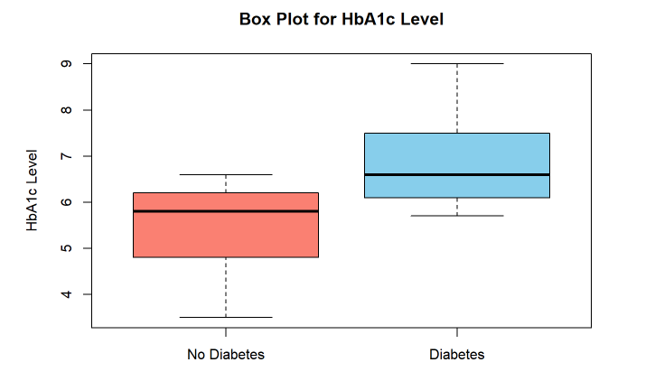

# Diabetes-Prediction

  

Diabetes is a chronic condition affecting millions worldwide and is caused by elevated blood glucose levels. Early detection and accurate prediction of diabetes can significantly improve patient outcomes through personalized care. This analysis aim to explore and predict diabetes cases using a comprehensive dataset containing various patient attributes, including age, gender, BMI (Body Mass Index), blood glucose levels, and HbA1c levels. The data used in this analysis is sourced from Kaggle website. Kaggle dataset for diabetes prediction

The objective of this analysis is to construct robust prediction models based on decision trees, leveraging the power of two popular R packages, party and rpart. To achieve our goal, the following steps are performed:

Data Exploration: The analysis will begin by loading and inspecting the dataset to understand its structure and basic statistics. This step will help us identify missing values, distributions of features, and the prevalence of diabetes cases within the dataset.

Feature Visualization: Through a series of insightful plots, including histograms, bar plots, and box plots, the analysis visually explores the distribution and relationships between individual features and diabetes occurrence. These visualizations will provide a deeper understanding of how different attributes relate to the target variable.

Data Preprocessing: Before building the prediction models, we will preprocess the data by converting the target class into factors and potentially handling categorical variables.

Decision Tree Construction: Leveraging the party and rpart packages, we will construct two sets of decision trees. The party package offers conditional inference trees, while the rpart package implements the classic CART algorithm. By comparing the two approaches, we can evaluate which model best fits our dataset and provides meaningful predictive insights.

Model Evaluation: To ensure the reliability and accuracy of our prediction models, we will partition the data into training and testing sets. We will then evaluate the models’ performance using metrics such as misclassification errors to assess their predictive capabilities.

Through this diabetes prediction analysis, we aim to contribute to the growing field of medical data analysis, potentially aiding healthcare practitioners in early detection and tailored interventions for patients at risk of diabetes. Moreover, the interpretability of decision trees will enable us to understand the factors driving the predictions, paving the way for more informed and targeted healthcare strategies.